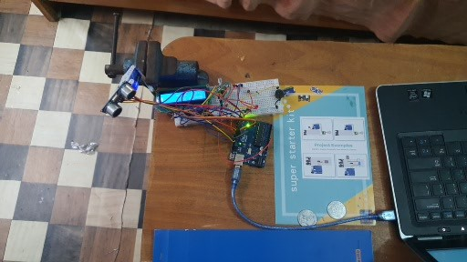

# Radar_arduino
un petit projet radar fait avec arduino uno et un capteur ultrason H-SR04

## DESCRIPTION
Ce projet utilise un servomoteur et un capteur ultrason pour scaner l'environement et detect les obstacles. Les données sont affichées sur un écran LCD 16*2
## MATERIEL UTILISE
- Arduino uno
- Capteur ultrason Hc-SR04
- Servomoteur SG90
- Ecrant LCD 16*2
- potensiomètre
- Led rouge
- Buzzer
- Resistance
- Fils Dupont
- Breadboard
## FONCTIONNEMENT
1. Le servomoteur fait tourner le capteur  de 0° à 180° et de 180° à 0°
2. Le capteur mesure la distance à chaque angle
3. Les valeurs sont envoyeés au lcd pour l'affichage de l'angle et la distance
 
## Installation
1. Télécharger le fichier 'radar.ino'
2. Ouvre le dans l'IDE Arduino
3. Installe la librairie 'Servo.h' et 'LiquidCrystal.h' si ce n'est pas déjà fait
4. Upload sur la carte Arduino
 
### MONTAGE
  

## DEMONSTRATION VIDEO

[Voir la démo sur youtube](LIEN_YOUTUBE)

## AUTEUR
Luc977

